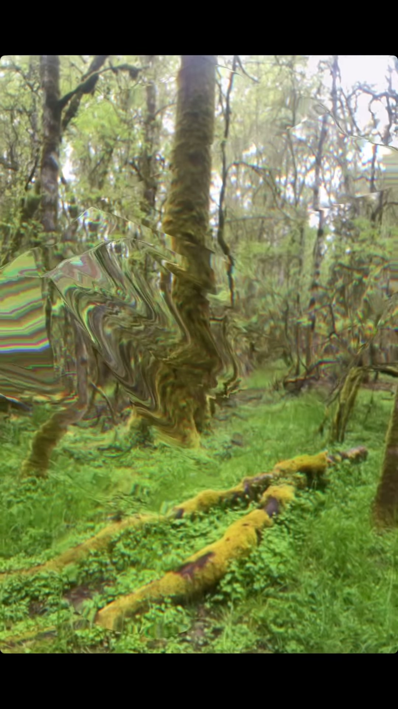

# blob

A hand-tracked refractive **glass / slime / cloth** that lives in your hand, in the browser. Hold up a hand and a gooey membrane forms over your palm and drips with gravity; hold up **two** hands and it stretches into a sagging sheet between them, bending and chromatically splitting whatever is behind it.

**Live:** https://blob.jonasjohansson.se/

Built as a study after [@alwayscodingsomething](https://www.instagram.com/alwayscodingsomething/)'s refractive-glass reel — rebuilt from scratch as a real-time webcam effect.



## Use it

Allow the camera when prompted (needs HTTPS — the live link qualifies), then:

- **One hand** → a connected blob of slime over your palm, dripping downward with momentum.
- **Two hands** → a cloth/membrane stretched between your palms. Pull them apart and together to feel it sag and wobble.
- **No hand / no camera** → it follows your cursor, and falls back to a forest still.

### Sources
- **📷 Webcam** — refract the real world (default).
- **🎞 Reel** — refract the original source clip.
- **🌲 Forest** — a still fallback.

### Controls
- **🦴 Skeleton** — debug overlay: hand landmarks, the palm target (red), and lobe coverage.
- **⏸ Freeze** — pin the blob in place.
- **● Record** — capture the canvas (effect only) to a `.webm`.
- **Blob controls** panel — 18 live sliders (refraction, dispersion, cloth folds, fold scale, iridescence, body/opacity, gravity, momentum, wave, edge threshold, rim glow, blob size, membrane width, cohesion, palm/finger radius, follow smoothing) plus a **tint** colour picker. `reset` restores defaults.

## How it works

Single self-contained `index.html`, no build step.

- **Hand tracking** — [MediaPipe Tasks Vision](https://developers.google.com/mediapipe) `HandLandmarker` (up to 2 hands) on the webcam feed.
- **Shape** — a signed-distance field: circle SDFs for palm + knuckles and **capsule** SDFs for the drip strand / membrane, combined with a smooth-minimum (`smin`) so it stays one cohesive surface instead of separating into droplets.
- **Physics** — a lightweight 2D **Verlet** mass-spring chain (the idea borrowed from the three.js WebGPU compute-cloth example, run in JS so it stays plain WebGL). Endpoints pin to the palms; gravity + damping give the sag, momentum, and wobble.
- **Material** — fragment-shader refraction of the camera texture with per-channel chromatic dispersion, ridged-noise cloth folds aligned to the stretch direction, fold shading (creases dark / ridges bright), thin-film iridescence, a wet specular highlight, and a translucent tinted body.
- The whole effect is screen-space WebGL 1, so it runs everywhere (no WebGPU required).

## Run locally

It's a static page — serve the folder over HTTP (the camera API needs `localhost` or HTTPS):

```sh
python3 -m http.server 8000
# open http://localhost:8000
```

## Files
- `index.html` — everything (markup, shaders, JS).
- `forest.jpg` — fallback background.
- `reel.mp4` — the source clip used by the 🎞 Reel background.
- `CNAME` — GitHub Pages custom domain.

## Credits
Concept inspired by [@alwayscodingsomething](https://www.instagram.com/alwayscodingsomething/). Built by [Jonas Johansson](https://jonasjohansson.se).
